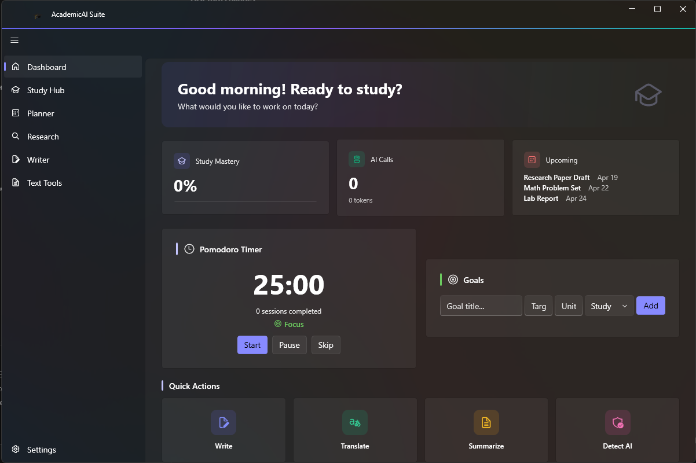
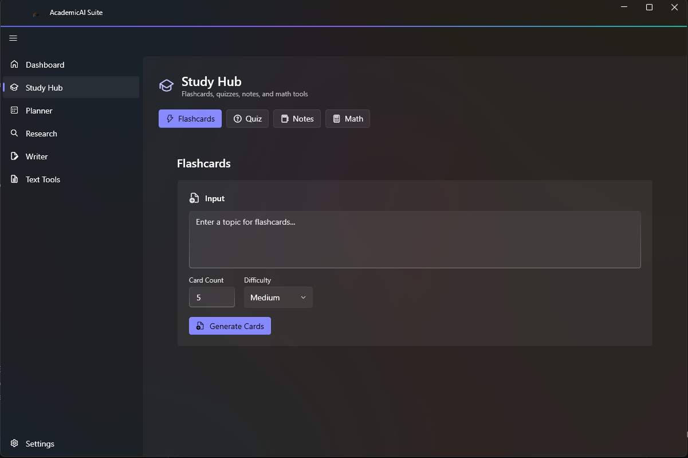
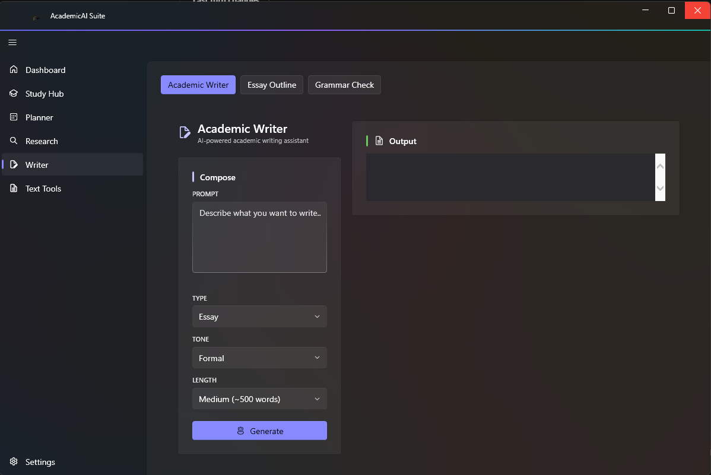
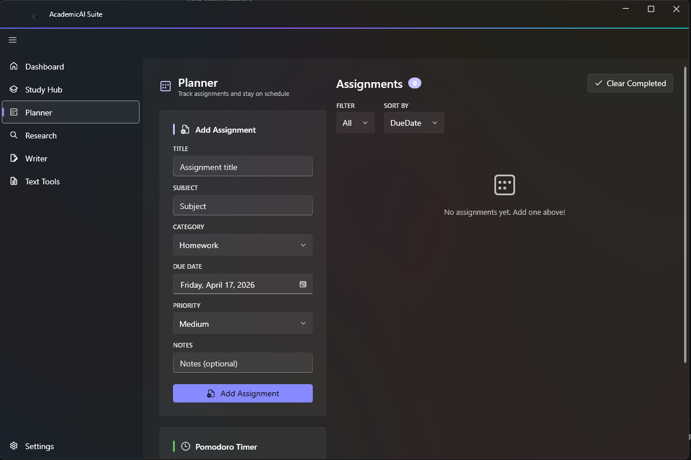
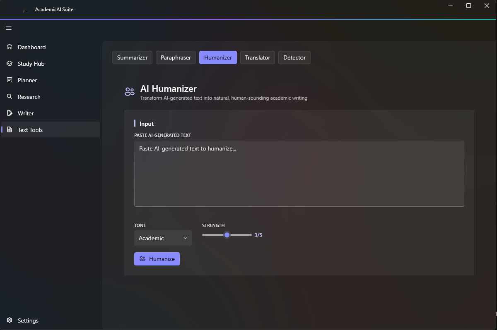
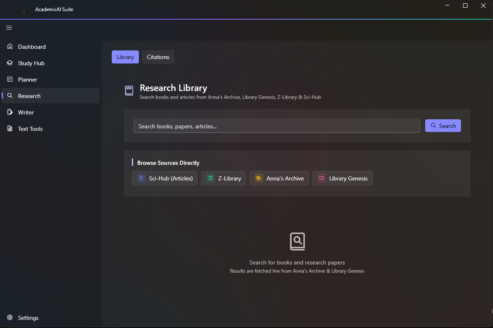

<p align="center">
  
  <h1 align="center">AcademicAI Suite</h1>
  <p align="center">AI-Powered Academic Toolkit for Students</p>
</p>

<p align="center">
  
  
  
  
</p>

---

## Features

### Study Hub
- **Flashcards** — AI-generated flashcard decks with difficulty ratings and spaced repetition
- **Quiz Generator** — Multiple choice, true/false, short answer, and mixed quizzes
- **Note Organizer** — Transform raw notes into structured, organized formats
- **Math Solver** — Step-by-step solutions for math problems

### Planner
- Goals with categories, priorities, and progress tracking
- Assignments with due dates and urgency badges
- Built-in Pomodoro timer (25/5 min) with floating window
- Study streak tracking

### Research
- **Research Library** — AI-powered academic paper search
- **Citations** — Generate APA, MLA, Chicago, Harvard, and IEEE citations

### Writer
- **Academic Writer** — Generate essays, papers, and reports with type and tone options
- **Essay Outliner** — Create detailed essay outlines (argumentative, expository, narrative, etc.)
- **Grammar Checker** — Detect and fix grammar, spelling, and punctuation errors

### Text Tools
- **Summarizer** — Brief, medium, or detailed summaries
- **Paraphraser** — Rewrite in academic, casual, creative, or concise style
- **Humanizer** — Make AI-generated text sound more natural
- **Translator** — Translate between 50+ languages
- **AI Detector** — Analyze text for AI-generated probability with reasoning

### Platform Features
- **7 Languages** — English, Arabic (RTL), French, Spanish, German
- **2 AI Providers** — OpenRouter & Fireworks (bring your own API key)
- **Remote Kill Switch** — Deactivate app or revoke licenses remotely
- **Auto-Update** — Automatic update checking with mandatory update support
- **Fluent Design** — Windows 11 Mica backdrop, theme switching, system accent color
- **System Tray** — Minimize to tray with context menu
- **PDF Support** — Drag-and-drop PDF text extraction
- **AES-256 Encryption** — Secure API key storage

---

## Screenshots

| Dashboard | Study Hub | Writer |
|:---:|:---:|:---:|
|  |  |  |

| Planner | Text Tools | Research |
|:---:|:---:|:---:|
|  |  |  |

---

## Download

[**Download v3.0.0**](https://github.com/MrBlizo/AcademicAI-Suite/releases/latest)

### Requirements
- Windows 10/11 (x64)
- [.NET 9.0 Desktop Runtime](https://dotnet.microsoft.com/download/dotnet/9.0)

---

## Getting Started

1. Download and extract the zip from the [latest release](https://github.com/MrBlizo/AcademicAI-Suite/releases/latest)
2. Run `AcademicAI.exe`
3. On first launch, the onboarding wizard will guide you through:
   - Adding your API key (OpenRouter or Fireworks)
   - Selecting your preferred language
4. Start using any tool from the navigation sidebar

### API Keys

AcademicAI Suite uses your own API keys — we never collect or share them.

| Provider | Get API Key | Models Available |
|----------|------------|-----------------|
| **OpenRouter** | [openrouter.ai/keys](https://openrouter.ai/keys) | GPT-4o, Claude 3.5 Sonnet, Gemini 2.0 Flash, LLaMA 3.3, Qwen 2.5 |
| **Fireworks** | [fireworks.ai/api-keys](https://fireworks.ai/api-keys) | LLaMA 3.3, Qwen 2.5, Mixtral 8x22B, DeepSeek V3 |

---

## Building from Source

```bash
git clone https://github.com/MrBlizo/AcademicAI-Suite.git
cd AcademicAI-Suite
dotnet restore AcademicAI.sln
dotnet build AcademicAI.sln
dotnet run --project src/AcademicAI.App/AcademicAI.App.csproj
```

### Project Structure

```
AcademicAI/
├── src/
│   ├── AcademicAI.Core/          # Models, interfaces, services (net9.0)
│   ├── AcademicAI.Agents/        # AI agent implementations (net9.0)
│   ├── AcademicAI.Academic/      # Text processors (net9.0)
│   ├── AcademicAI.Humanizer/     # Text humanizer (net9.0)
│   ├── AcademicAI.Detection/     # AI detection (net9.0)
│   └── AcademicAI.App/           # WPF application (net9.0-windows)
│       ├── Views/                # Pages & windows
│       ├── ViewModels/           # MVVM view models
│       ├── Controls/             # Custom user controls
│       ├── Converters/           # Value converters
│       ├── Services/             # App-specific services
│       ├── Lang/                 # Localization JSON files
│       └── assets/               # Icons & images
├── tools/                        # Utility projects (logo gen, etc.)
├── installer/                    # Inno Setup script
├── .github/workflows/            # CI/CD release workflow
└── control.json                  # Remote control config (kill switch)
```

---

## Remote Control (Kill Switch)

The app checks `control.json` on startup for:

| Field | Purpose |
|-------|---------|
| `alive` | Set `false` to deactivate the app globally |
| `revokedKeys` | Array of license keys to revoke |
| `latestVersion` | Triggers update prompt if different from app version |
| `downloadUrl` | URL for the update download |
| `mandatoryUpdate` | Set `true` to force update before use |

---

## Tech Stack

- **.NET 9** with WPF
- [WPF-UI 3.0.5](https://github.com/lepoco/wpfui) — Windows 11 Fluent Design
- [CommunityToolkit.Mvvm 8.4](https://learn.microsoft.com/dotnet/communitytoolkit/mvvm/) — MVVM source generators
- [PdfPig](https://github.com/UglyToad/PdfPig) — PDF text extraction
- [Markdig](https://github.com/xoofx/markdig) — Markdown processing
- [Hardcodet.NotifyIcon.Wpf](https://github.com/hardcodet/wpf-notifyicon) — System tray
- [Microsoft.Extensions.DependencyInjection](https://learn.microsoft.com/dotnet/core/extensions/dependency-injection) — DI container

---

## License

This project is licensed under **Creative Commons Attribution-NonCommercial 4.0 International** — see [LICENSE](LICENSE) for details.

Free for personal and educational use. Commercial use is prohibited.
